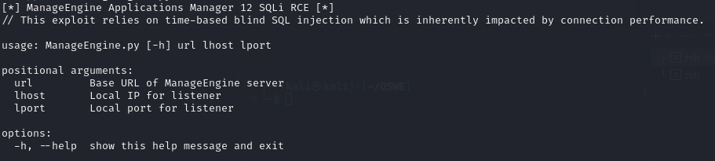

# ManageEngineRCE
ManageEngine Application Manager 12 suffers from a blind SQLi vulnerability that may be used to gain unauthenticated remote code execution.

## Usage and Methods

This tool offers a variety of attack vectors for AppManager 12. The use of Postgres large objects to craft a reverse shell UDF is the preferred method, although alternatives have been made available if you share an internal network with the host (or other SMB permissive connection).
Included in the tool as well are destructive backdoor injections for monitor VBS scripts and AppManager startup batch applications. The VBS scripts are less likely to be detected, as the AppManager process will still execute the scripts but no monitoring data will be provided. The batch injection will completely break startup functionality for AppManager. Use this option carefully.
![Methods menu])(./methods.png)

## Disclaimer
This tool is meant for educational purposes. I do not condone the usage of this tool for any malicious or illegal use.
